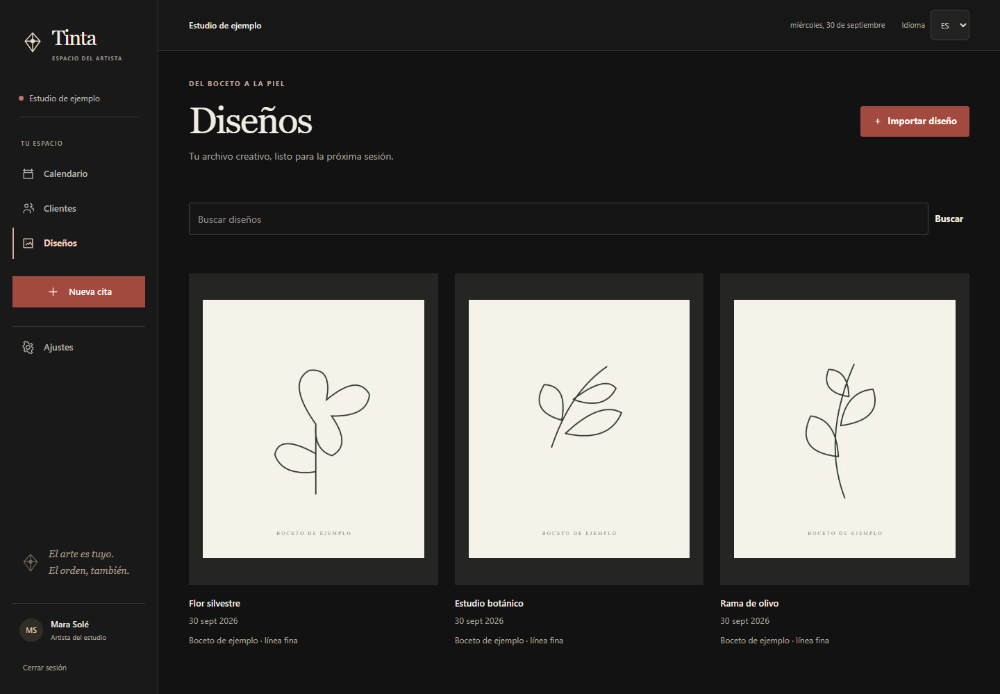
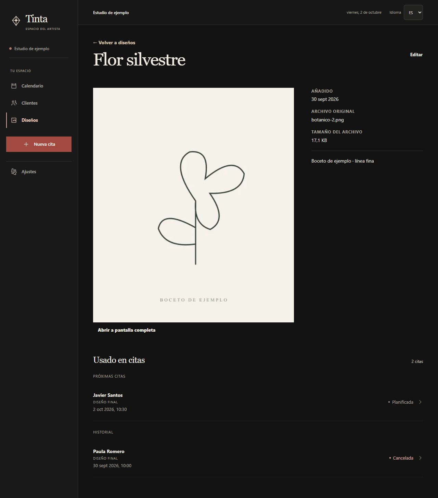
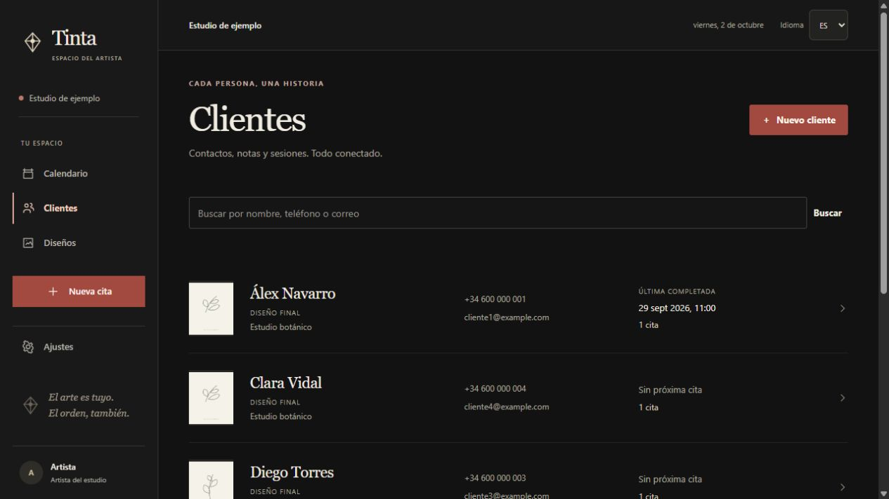
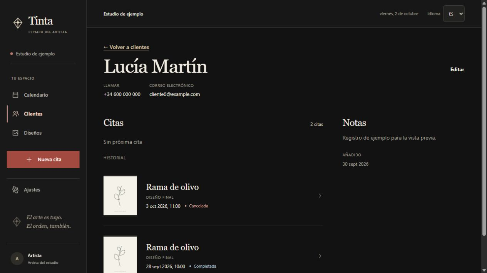
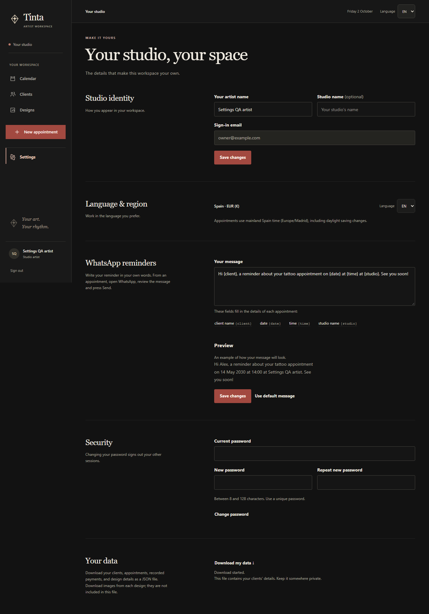
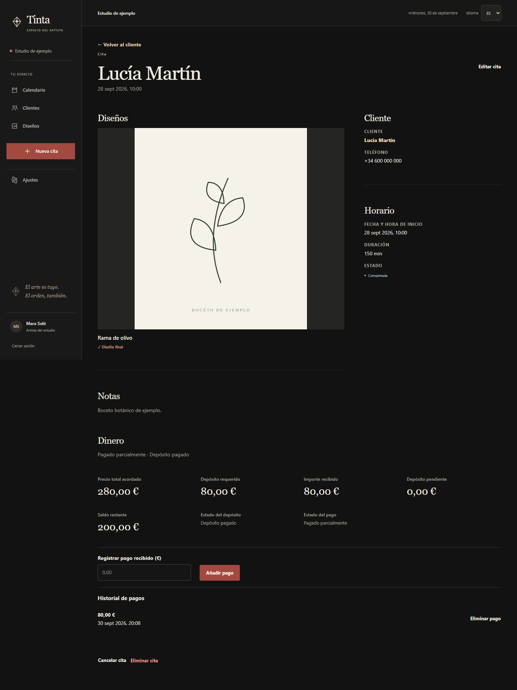
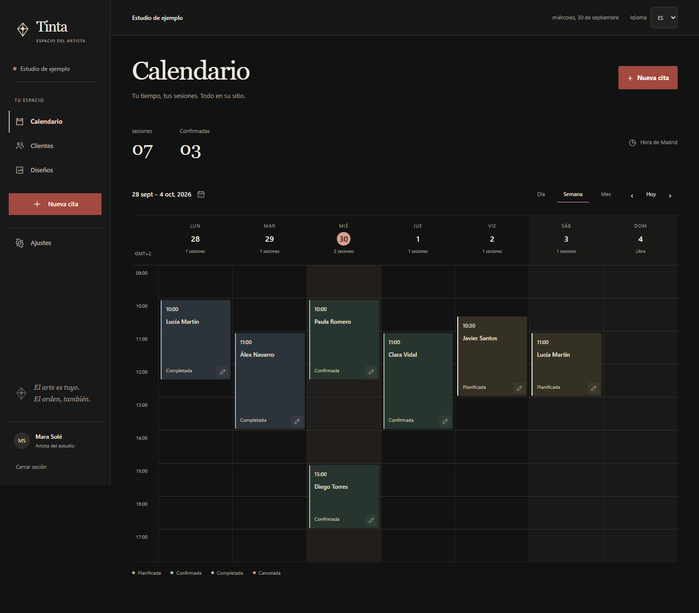

# Private tattoo workspace

Tinta is one tattoo artist's private workspace. The artist chooses their studio name. Its visual direction is dark, editorial and restrained: charcoal, warm ivory, muted terracotta, serif display headings and artwork as the focal point.

## Audit and changes

The previous interface framed unrelated information equally. Repeated section cards, nested appointment cards, boxed search forms, artwork captions inside containers and framed calendar summaries created a dashboard appearance.

The redesign removes outer frames from client lists, search groups, settings sections, appointment form sections, appointment metadata, notes and payments. Design images sit on quiet mats with captions below. The calendar keeps its useful time grid and gives appointment objects a status edge and subtle background. Status labels use a small dot and text rather than a pill.

Use composition, type and space before a frame. Keep visible control boundaries for inputs, focus indicators and the primary action. A dialog or an independent interactive object can retain a surface; a simple text group cannot.

## Tokens and primitives

`studio-theme.css` owns the palette. `workspace.css` owns the editorial layout primitives and shared rhythm.

| Token | Purpose |
| --- | --- |
| `--bg`, `--surface-soft`, `--text`, `--muted`, `--accent`, `--action` | Charcoal surfaces, ivory text and restrained terracotta actions |
| `--space-small`: 12px | Caption and heading relationships |
| `--space-group`: 24px | Rows and related objects |
| `--space-section`: 32–56px | Separate sections and columns |
| `--rule`: translucent white | Quiet horizontal division |
| `--type-display`: 38–54px | Page titles |
| `--radius`, `--radius-small`: 2px, 3px | Objects and controls; sections have no radius |

| Primitive | Use |
| --- | --- |
| `workspace-stack` | Vertical rhythm without an enclosing card |
| `workspace-split` | Unequal editorial columns; artwork can lead; stacks on smaller screens |
| `workspace-section` | An open group, optionally separated by a horizontal rule |
| `section-intro` | Serif section title with concise supporting text |
| `data-row` | List or history row with a bottom divider |
| `artwork-object` | Image first, open caption below; selection indicated on the image |

Reuse these primitives rather than introducing a new card class for each page. Existing component classes retain functional layout responsibilities. Avoid a card inside another card, an outer panel around a whole page or matching boxes for metadata and artwork.

## Appointment interactions

`appointment-workflows.css` reuses the shared spacing, palette and rule tokens. The record header groups date, status, contact and actions before the artwork. Focused rescheduling opens between horizontal rules; errors use a short accent edge and visible focus rather than a surrounding card. Form errors are linked to their fields and retain the artist's entered values.

Date and time controls stay consistent across creation and editing. References are optional, and supplementary price/deposit fields use a disclosure that opens when needed for editing or error correction. The payment record leads with price, received amount and remaining balance; deposit information is secondary. Cancelled/no-show records show a neutral signed difference between price and received amounts, without implying a cancellation or refund policy.

Adding a client or importing artwork from a booking stores a bounded, short-lived draft in the current tab's session storage. Return URLs carry an opaque token, not notes or payment values. Newly created records are selected on return, and the temporary snapshot is consumed.

## Artwork interactions

The library and design detail retain their artwork-first composition. Fullscreen uses the existing native dialog with the artwork title as its accessible name, loading feedback and Close/Escape focus restoration. The original image mounts only while the viewer is open. If it cannot be displayed, the viewer tries the private preview once and identifies that fallback after it loads; if both images fail, a clear error and explicit Retry keep recovery deliberate.

Rejected metadata saves retain the raw title and notes the artist entered. Inline errors identify their fields, and the focused summary links back to those controls. Save and Cancel keep the library search context, as do opening details, editing and confirmed deletion. Navigation carries only a normalized keyword of at most 500 characters and builds destinations from fixed application paths.

Used-in-appointment rows reuse the open history groups, status text and focus treatment. Upcoming contains future planned/confirmed bookings earliest first; History contains every remaining owned linked appointment latest first. Each record appears once, with an explicit Final design or Reference role for that appointment. The total includes all outcomes, and both appointment dates and artwork Added dates use Europe/Madrid. These refinements preserve the existing tattoo workspace scope and visual identity.

## Settings interactions

Settings keep the existing open, labelled sections. Profile fields retain entered text after rejected saves, with inline field errors and a focused summary linking to the affected control. Unsaved feedback compares the current draft with the latest successful save; further edits clear stale success messages. Password feedback also clears when the artist starts another edit, while the existing account behavior remains intact.

Reminder fields are quiet inline actions below the message. They insert a complete placeholder at the current cursor or replace selected text, return focus to the message and respect its length limit. Restoring the default changes the draft and offers Undo; the artist still saves explicitly. The preview uses the current studio identity and example appointment values. Changing the Settings language retains the current reminder draft. These controls support the existing manual WhatsApp workflow.

The data download action announces preparation, checks for a valid export response and offers Retry after a failure. Success means the browser download has started. Feedback reuses the existing text, error and status styles without adding section cards.

## Client directory

Client rows use a small private artwork preview, a larger serif name and aligned contact/booking information. Artwork comes from the client's own appointment records, preferring the selected booking's final design and then a reference. Clients without linked artwork use an unframed monogram. Design captions identify final selections or references; they do not describe images as completed tattoos.

Booking context shows the next future planned/confirmed appointment, or the latest completed appointment. The labelled count includes all appointment records, including cancelled and no-show entries. Rows retain alphabetical ordering, contact search and a single full-row link. Mobile rows stack the same information compactly; hover and keyboard focus use the existing quiet surface and terracotta tokens.

## Client record

The header groups the name, Edit and labelled Call/Email links with their contact values. Appointment rows lead the wider column; notes use an open, quieter column, with the creation date secondary and formatted in Europe/Madrid. The shared `workspace-split` stacks appointments before notes on mobile.

Upcoming contains only future planned/confirmed appointments, ordered earliest first, with the first labelled as the next appointment. History contains every remaining appointment, ordered latest first, including cancelled/no-show outcomes and past active records. Each owned appointment appears once, and the labelled total counts every outcome. History is not described as completed tattoos or past-only bookings.

Each row displays one real owned artwork preview from that appointment, preferring its final selection and labelling other artwork as a reference. Detail rows never borrow artwork from a different appointment. Rows without artwork remain plain text rather than an empty image frame. The whole row opens the appointment, with visible keyboard focus and no nested links; status text and Madrid date/time stay readable alongside the artwork title.

## Measured reduction

At 1440px, the same seven populated routes were audited before and after using computed styles. The measure counts rendered elements at least 120px wide and 45px high with a visible border on all four sides; input controls are outside the count. The calendar's primary action link is included consistently in both runs.

| View | Before | After |
| --- | ---: | ---: |
| Weekly calendar | 10 | 1 |
| Clients | 2 | 0 |
| Designs | 4 | 0 |
| New appointment | 8 | 0 |
| Settings | 4 | 0 |
| Appointment details | 6 | 0 |
| Client details | 2 | 0 |
| Total | 36 | 1 |

This is a 97% reduction in fully outlined elements under this measure. It measures borders, not all visible surfaces: artwork mats, calendar event fills, form controls and accessible focus outlines remain intentional.

Visual verification also covers mobile calendar and artwork layouts, the asymmetric appointment composition, settings column alignment and open form sections. Browser workflow tests verify that the layout changes preserve client, design, appointment and payment actions.

## Preview

These screenshots use fictitious demo records and sample artwork.

